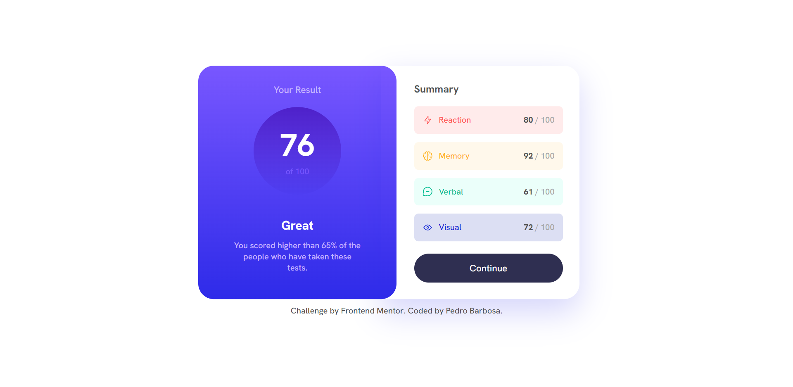
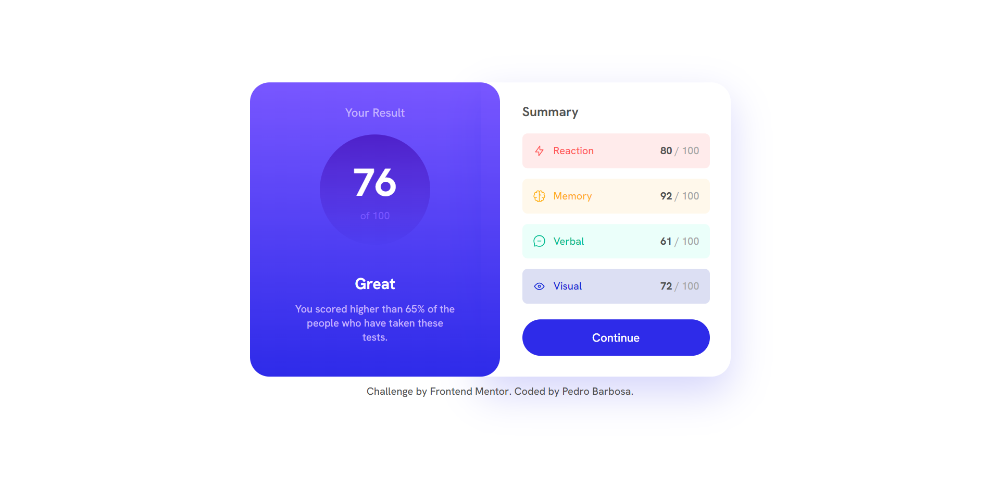
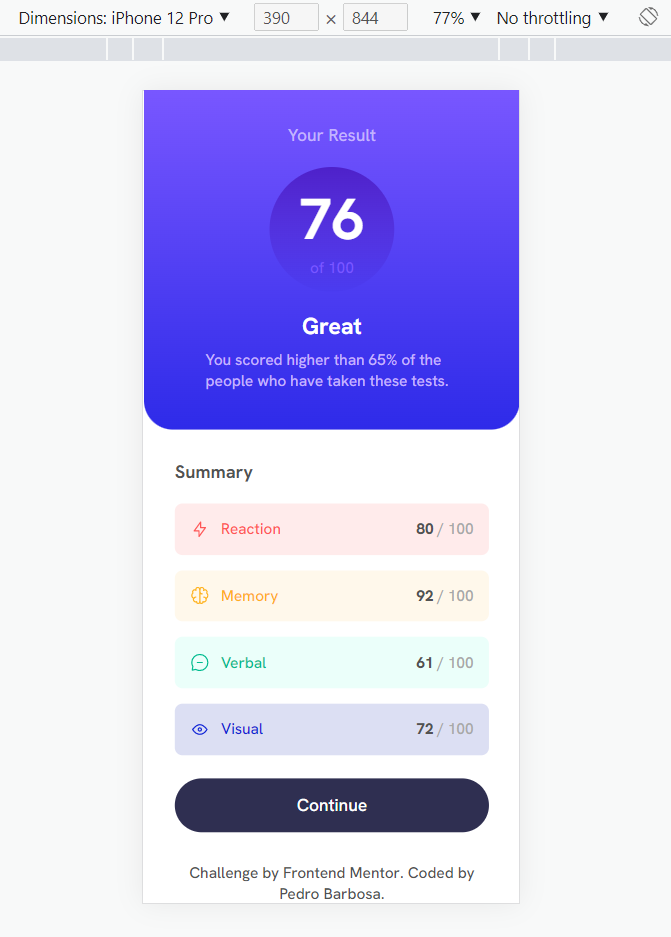

# Frontend Mentor - Results summary component solution

This is a solution to the [Results summary component challenge on Frontend Mentor](https://www.frontendmentor.io/challenges/results-summary-component-CE_K6s0maV). Frontend Mentor challenges help you improve your coding skills by building realistic projects.

## Table of contents

- [Overview](#overview)
  - [The challenge](#the-challenge)
  - [Screenshot](#screenshot)
  - [Links](#links)
- [My process](#my-process)
  - [Built with](#built-with)
  - [Highlights](#highlights)
  - [Continued development](#continued-development)
- [Author](#author)

## Overview

### The challenge

Users should be able to:

- View the optimal layout for the interface depending on their device's screen size
- See hover, active and focus states for the Continue button

### Screenshots





### Links

- Solution URL: [https://github.com/pedrommb7/results-summary-component](https://your-solution-url.com)
- Live Site URL: [https://resultssummary.netlify.app](https://resultssummary.netlify.app/)

## My process

### Built with

- HTML
- SCSS, BEM
- Atomic design
- Flexbox
- Mobile-first workflow
- [React-TypeScript](https://create-react-app.dev/docs/adding-typescript/)

### Highlights

Using the high order array map() I was able to place all the areas scored with just a few lines of code.

```js
{
  data.map((item) => (
    <AreasScored key={item.id} status={item.category} score={item.score} />
  ));
}
```

### Continued development

In the future I intend to use React hooks on my frontendmentor projects.

## Author

- Frontend Mentor - [@pedrommb7](https://www.frontendmentor.io/profile/pedrommb7)
